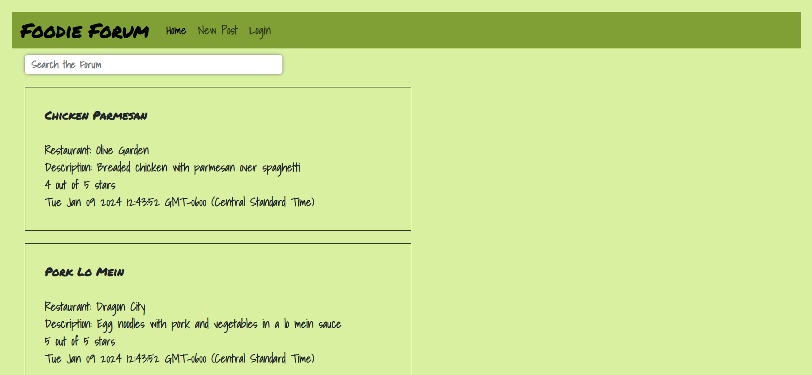
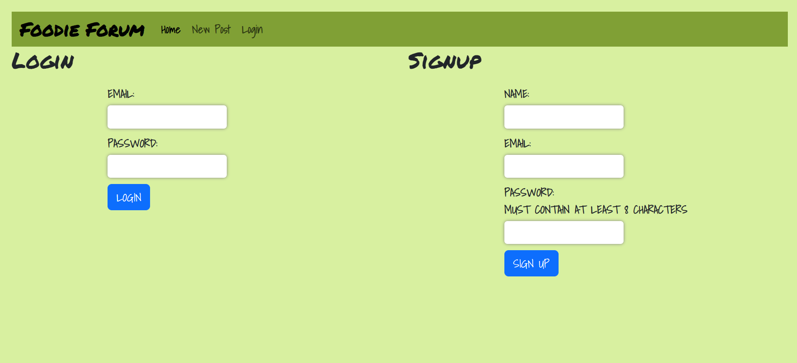
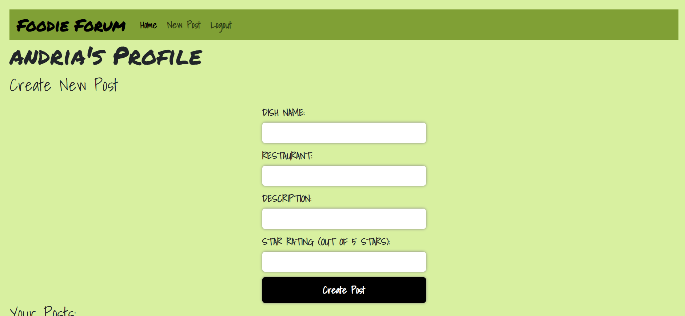
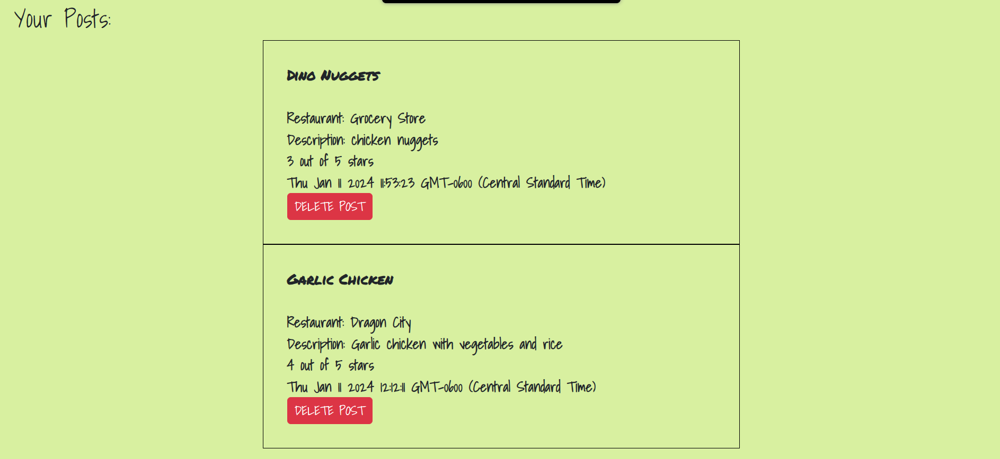

# Foodie Forum

## Table of Contents
* [Description](#description)
* [Installation](#installation)
* [Usage](#usage)
* [Tests](#tests)
* [Contributing](#contributing)
* [License](#license)
* [Questions](#questions)

## Description
Our motivation for building this project was to encourage people to try new things by giving them some reassurance. This project does just that by giving users a star rating for foods they may not have tried yet. We built this project to test our knowledge of building full stack web applications using a mySQL databases, node.js, and express. We learned a lot more about connecting the frontend to the back end and storing user data to a database.

## Installation
No installation required, simply go to our website to try Foodie Forum: 

https://foodie-forum-8-9cb2bc2e8559.herokuapp.com/

## Usage
Users can search the forum using any keywords in the search bar. Search results will automatically populate as the user is typing. Using the options on the navbar, users can create a new post or log in. However, users must be logged in to create a new post. 

The login option on the navbar takes the user to a screen where members can log in or new users can sign up to be a member. 

Once the user has logged in or signed up they can create and manage their posts from their profile page.

## Tests
We tested the application using insomnia and live server in the browser

## Contributing
Andria Goodwin - https://github.com/andria-goodwin 
Alfredo Mercado - https://github.com/amercado94 
Jacob Kueck - https://github.com/Jakobytk 
Kristofer Vickers - https://github.com/KristoferVickers 
Roderick Harris - https://github.com/Roro21007

## License
This project is covered under the MIT license. To learn more about what this means, click the license button at the top.

## Questions
If you have any questions, please feel free to reach me at andria.goodwin1@gmail.com or visit my GitHub profile @ https://github.com/andria-goodwin